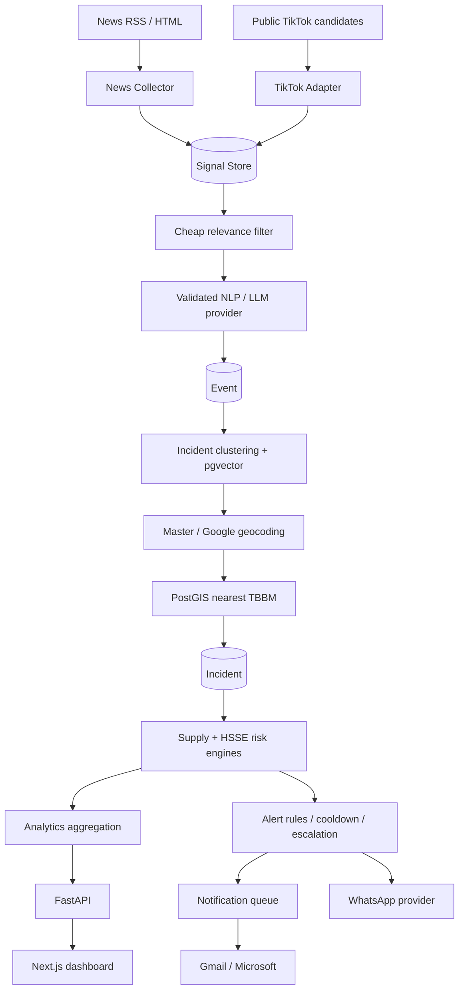

# Fuel Distribution News & HSSE Intelligence Platform

Production-oriented full-stack platform for scheduled monitoring of Indonesian fuel-distribution news and compliant public TikTok candidates. It turns source records into structured events, clusters corroborating evidence into incidents, resolves location/SPBU/TBBM context, calculates separate supply and HSSE risk, aggregates analytics, and sends deduplicated WhatsApp or email notifications.

The repository runs without synthetic records. Public live News RSS collection is enabled by default. Leaflet renders OpenStreetMap tiles; Google Geocoding enriches unresolved incident coordinates when a backend API key is configured, while PostGIS always calculates nearest-TBBM straight-line distance locally. Without that key, canonical master coordinates and PostGIS nearest-TBBM matching remain available.

## Core evidence contract

```text
SIGNAL  = one News article or one public TikTok post
EVENT   = validated structured extraction from one signal
INCIDENT = a real-world occurrence supported by one or more signals
```

A TikTok post is treated as an early signal, not verified fact. News is the corroboration layer. Multiple source records can therefore support one incident without being collapsed into one article row.

## Architecture



Traefik exposes the Next.js application at `/` and FastAPI at `/api`. PostgreSQL and Redis remain private on the Compose network.

## Services

The default Compose project starts:

- `traefik`, `frontend`, `api`
- `news-worker`, `tiktok-worker`, `nlp-worker`, `geo-worker`
- `incident-worker`, `analytics-worker`, `alert-worker`, `notification-worker`, `whatsapp-worker`
- `scheduler` (Celery Beat), `postgres`, and `redis`

Every service uses `restart: unless-stopped` except the opt-in test runner. PostgreSQL includes PostGIS and pgvector, supports AMD64 and ARM64, and stores its cluster in `postgres_data`.

## Repository structure

```text
.
├── backend/
│   ├── alembic/                 # non-destructive forward migrations
│   ├── app/
│   │   ├── api/                 # public, internal, and admin routes
│   │   ├── collectors/          # News and TikTok adapter boundaries
│   │   ├── services/            # pipeline, geography, risk, analytics, providers, alerts
│   │   ├── workers/             # Celery application and idempotent tasks
│   │   ├── models.py            # SQLAlchemy/PostGIS/pgvector models
│   │   └── live_sources.py      # idempotent live News source registration
│   ├── tests/
│   └── Dockerfile
├── frontend/
│   ├── app/                     # Next.js App Router pages
│   ├── components/              # dashboard, filters, tables, detail views
│   ├── lib/ and types/
│   └── Dockerfile
├── database/                    # sanitized Git-tracked bootstrap snapshot + manifest
├── scripts/                     # snapshot export and verification
├── infrastructure/postgres/     # multi-arch PostGIS + pgvector build + first-install restore
├── install.sh                   # one-command Docker installer
├── docker-compose.yml
├── .env.example
└── Makefile
```

## System installer and quick start

Prerequisite: Docker Desktop or a compatible Docker Engine with Compose v2. No host PostgreSQL, Redis, Python, or Node installation is required. On Windows, run the installer from WSL or Git Bash with Docker Desktop integration enabled.

```bash
git clone <repository-url>
cd newspaper
./install.sh
```

The installer validates the database snapshot checksum, creates `.env` with unique local secrets when it does not yet exist, enables the repository Git hook, builds the images, starts the stack, and waits for every health check. It never overwrites an existing `.env`.

On the first start of a new PostgreSQL volume, `database/bootstrap.dump` is restored automatically before the API starts. The tracked snapshot includes the current schema and operational data, including News/TikTok source records, all retained signals/events/incidents, risk/analytics history, Master TBBM, discovery candidates, and provenance. If the volume already contains a database, initialization scripts do not run and the existing data is retained.

Open:

- Dashboard: <http://localhost>
- In-app documentation: <http://localhost/documentation>
- FastAPI documentation: <http://localhost/api/docs>
- API readiness: <http://localhost/ready>

The API container applies the forward Alembic migration, idempotently registers public live News feeds, and queues an immediate priority-feed collection. Startup never creates synthetic evidence or runs a destructive migration. To stop the platform while retaining data:

```bash
docker compose down
```

To remove all persisted application data, explicitly run `docker compose down -v`. This is destructive, removes live records too, and is never part of normal startup. A subsequent install creates a new volume and restores the Git-tracked snapshot again.

For a manual install with an already prepared `.env`, `docker compose up -d --build --wait` remains supported and uses the same first-volume snapshot restore.

## Environment configuration

Copy `.env.example`; do not commit `.env`. Important provider defaults are:

```env
LLM_PROVIDER=mock
GEOCODING_PROVIDER=google
GOOGLE_MAPS_API_KEY=
TIKTOK_PROVIDER=SCRAPECREATORS
APP_ENCRYPTION_KEY=
EMAIL_TOKEN_ENCRYPTION_KEY=
GOOGLE_CLIENT_ID=
GOOGLE_CLIENT_SECRET=
GOOGLE_OAUTH_REDIRECT_URI=http://localhost/api/email/oauth/google/callback
MICROSOFT_CLIENT_ID=
MICROSOFT_CLIENT_SECRET=
MICROSOFT_TENANT=common
MICROSOFT_OAUTH_REDIRECT_URI=http://localhost/api/email/oauth/microsoft/callback
SCRAPECREATORS_API_KEY=
SCRAPECREATORS_BASE_URL=https://api.scrapecreators.com
WHATSAPP_PROVIDER=mock
LIVE_NEWS_ENABLED=true
NEXT_PUBLIC_OSM_TILE_URL=https://tile.openstreetmap.org/{z}/{x}/{y}.png
```

`DATABASE_URL`, `REDIS_URL`, scheduler intervals, digest hour, risk weights, public base URL, alert recipient, and the production internal-ingestion token are environment-controlled. Email OAuth application settings are normally managed in the UI; the client secret remains backend-only and appears only as configured or not configured.

Use strong values for `POSTGRES_PASSWORD` and `INTERNAL_API_TOKEN` outside local development. Set `APP_BASE_URL` to the trusted public origin so alert links do not depend on forwarded host headers.

## Database and migrations

The initial migration enables:

```sql
CREATE EXTENSION IF NOT EXISTS postgis;
CREATE EXTENSION IF NOT EXISTS vector;
```

Then it creates indexed tables for sources, raw/clean News, TikTok posts and queries, signals, events, master geography, SPBU, terminals, incidents and evidence links, immutable risk history, alert rules/history, analytics aggregates, and worker heartbeats. Geography columns use SRID 4326 and GIST indexes. Incident/product fields have appropriate B-tree and GIN indexes.

Apply migrations manually:

```bash
make migrate
```

Create future revisions with Alembic; review generated operations before applying them. Destructive schema changes must never be added to the startup entrypoint.

### Versioned database snapshot and commit hook

The canonical portable snapshot is:

```text
database/bootstrap.dump       PostgreSQL custom archive
database/bootstrap.manifest   schema revision, row counts, timestamp, SHA-256
```

`install.sh` configures `core.hooksPath=.githooks`. Before every normal commit, `.githooks/pre-commit` performs a transactionally consistent dump of the active Compose database, restores it into a temporary database, sanitizes deployment-owned credentials and notification identities, creates the final archive, validates it, and stages both files. The commit fails closed if PostgreSQL is not running or the snapshot is invalid; this prevents a commit from silently carrying stale application data.

Manual commands:

```bash
make snapshot          # refresh snapshot from the active database
make verify-snapshot   # verify checksum and PostgreSQL archive structure
make hooks             # re-enable the tracked hook in this clone
```

The snapshot intentionally retains TBBM, all signals and their canonical lineage, incident/risk state, analytics, and discovery audit data. It intentionally removes or resets:

- the encrypted ScrapeCreators API key and provider-ready state;
- Gmail/Microsoft OAuth client secrets, access/refresh tokens, connected accounts, recipients, groups, rules, OAuth state, jobs, and delivery records;
- alert recipient identifiers and provider message IDs.

Google Maps secrets already live outside PostgreSQL in the private `provider_secrets` volume and are never included. `.env` and the encryption root keys are also excluded from Git. Every newly installed deployment must therefore configure its own Google, ScrapeCreators, and email credentials through the UI.

## Live-only data

The synthetic seed generator has been removed. Startup registers `Google News Fuel Distribution Watch` and `ANTARA News Terkini`; Celery collects the priority feed immediately and refreshes it on schedule. Set `LIVE_NEWS_ENABLED=false` only when an isolated/offline deployment is intentional.

For installations upgraded from an older build, remove legacy demo evidence without deleting retained live News or live incidents:

```bash
make remove-demo
```

The cleanup removes demo News/TikTok evidence, demo-only incidents and derived risk/alert rows, demo sources, and demo SPBU mappings, then rebuilds analytics from retained live incidents.

## News collector architecture

`NewsSourceAdapter` isolates source retrieval from the downstream pipeline:

- `RSSNewsAdapter` is the working initial implementation using `feedparser`.
- `GenericHTMLAdapter` handles a single public article page without source-specific hard-coding.

The service canonicalizes URLs, strips common tracking parameters, cleans content, hashes normalized text, preserves raw rows, deduplicates source identities, creates a signal, and processes it idempotently. Before ingestion, each RSS/HTML candidate must match at least one active phrase from **Settings → News Keywords** in its normalized title or content. Matching is case-insensitive and uses phrase boundaries. Deterministic tests do not require internet.

The default live registry uses a fuel-distribution-focused Google News RSS query and ANTARA's public RSS endpoint. Feed failures are isolated per source and exposed through **Settings → News Sources** as `last_success` or `last_error`; they do not replace or delete previously ingested evidence. **Settings → News Keywords** provides Add, Edit, and Delete controls for the shared keyword list used by all active sources. Edits affect the next collection only, while deleting a keyword never removes retained articles. If no active keyword remains, scheduled collection exits explicitly with `SKIPPED_NO_ACTIVE_KEYWORDS`.

A compliant RSS path can be exercised with the internal endpoint:

```bash
curl -X POST http://localhost/api/internal/collectors/rss \
  -H 'Content-Type: application/json' \
  -H 'X-Internal-Token: change_me' \
  -d '{"feed_url":"https://example.org/feed.xml","source_name":"Example","source_domain":"example.org"}'
```

## TikTok adapter architecture and boundary

`TikTokSourceAdapter` keeps discovery independent from signal/event/incident processing. The repository provides:

- `MockPublicDiscoveryAdapter` for zero-credential development
- `PublicDiscoveryAdapter` boundary for an approved public discovery provider
- `ResearchAPIAdapter` boundary for authorized Research API access
- authenticated internal ingestion for known public URL/candidate metadata

The implementation does not bypass CAPTCHA, authentication, private-content controls, or anti-bot systems; it does not download or embed video. Adaptive query levels begin at Indonesia/province and are intended to narrow to regency/district/SPBU only after evidence or an active incident exists.

### TikTok Discovery with ScrapeCreators

The integrated **TikTok Discovery** module provides the production discovery path without creating a separate application. Create or sign in to an account at the [ScrapeCreators dashboard](https://app.scrapecreators.com/), copy its API key, then open **TikTok Discovery → Settings**. Enter only the ScrapeCreators API key, select **Test Connection**, save the settings, set daily/monthly credit limits, and then enable discovery. The provider authenticates requests using the `x-api-key` header; see the [official authentication guide](https://docs.scrapecreators.com/integrations/cli/). The browser never calls ScrapeCreators directly. The Next.js same-origin proxy adds the internal application credential, while FastAPI encrypts the provider key at rest and returns only configured/masked metadata.

Set a stable `APP_ENCRYPTION_KEY` in production. In development, the application creates a restricted `app_encryption_key` inside the shared `provider_secrets` volume so container recreation or internal-token rotation cannot invalidate stored TikTok credentials. `SCRAPECREATORS_API_KEY` and `SCRAPECREATORS_BASE_URL` remain deployment-managed fallbacks. Discovery is disabled by default and will not run until it is explicitly enabled and a key is available. If legacy ciphertext cannot be decrypted, Settings remains available, reports `CREDENTIAL_ERROR`, and asks the operator to save the provider key again instead of returning HTTP 500.

Celery checks due keywords every `TIKTOK_DUE_CHECK_SECONDS` (default 60 seconds). The effective schedule comes from each keyword's override or the global interval stored in `tiktok_settings`. Every scheduled or manual search creates a `tiktok_search_run`; every physical provider request creates a credit-audit row. Cursor pagination stops at the configured page limit, when no cursor remains, or when a duplicate-only page contains no new video.

The workflow is:

```text
due keyword / manual search
→ ScrapeCreators provider adapter
→ raw tiktok_video + provider/video-ID deduplication
→ fast caption/hashtag relevance screen
→ selective transcript (AI fallback OFF by default)
→ existing TikTok signal ingestion
→ existing event classification, location/SPBU resolution, incident clustering, nearest verified TBBM
→ existing risk, analytics, dashboard, and WhatsApp alert evaluation
```

The module stores no downloaded media by default. ScrapeCreators-specific paths, headers, and response parsing stay inside `ScrapeCreatorsTikTokProvider`; core discovery uses `TikTokDiscoveryProvider`, so another approved provider can replace it later.

Operational pages:

- **Overview** — 24-hour/7-day/30-day KPIs, categories, keywords, locations, credits, and recent videos
- **Keywords** — per-keyword priority, interval override, search overrides, run-now, enable/disable
- **Manual Search** — audited ad-hoc search through the normal pipeline
- **Videos** — raw metadata, matched keywords, relevance, incident, location, and nearest TBBM
- **Runs** — run statistics and per-request timeline
- **Settings** — encrypted credential, provider health, defaults, enrichment, schedule, and credit guard

Example public-candidate ingestion:

```bash
curl -X POST http://localhost/api/internal/signals/tiktok \
  -H 'Content-Type: application/json' \
  -H 'X-Internal-Token: change_me' \
  -d '{"video_id":"public-123","url":"https://www.tiktok.com/@public/video/123","username":"public","caption":"Pertalite habis di Oesapa Kupang","published_at":"2026-09-01T06:30:00Z","raw_location_text":"Oesapa"}'
```

## NLP and embedding providers

`LLMProvider` returns a validated Pydantic `StructuredEvent`, never free-form business data. Mock extraction uses deterministic Indonesian keyword/rule classification and covers supply disruption, reported transportation HSSE, and fuel-relevant external disruption. `ConfiguredLLMProvider` is the safe extension point for OpenAI, Gemini, Claude, or a local model.

`EmbeddingProvider` supplies a deterministic 64-dimensional fallback so clustering does not require an external embedding API. Production deployments can replace it without changing downstream incident logic.

## Geo, SPBU, and TBBM matching

Location evidence is normalized and matched against canonical names and aliases. Explicit content/caption/location hints are evaluated; creator location is not treated as primary evidence. When the master cannot resolve an incident, the backend sends only the extracted location phrase to the Google Geocoding API with an Indonesia country restriction. The stored coordinates, formatted address, provider, and confidence remain auditable. Unresolved locations remain valuable and keep `location_resolution_status=UNRESOLVED`.

SPBU numbers receive the strongest match score. Low-confidence names are not forced. For every incident with coordinates, PostGIS compares the full verified, non-deleted TBBM registry and stores the nearest straight-line distance with source `POSTGIS_STRAIGHT_LINE`. Travel duration is not calculated, and the distance is never presented as a road route. `serving_terminal_id` comes only from the SPBU operational master mapping. The system never assumes nearest terminal equals serving terminal.

Create or select a Google Cloud project, attach billing, enable **Geocoding API** and **Places API (New)**, then use **APIs & Services → Credentials → Create credentials → API key**. Restrict the key to the backend deployment and to only those two APIs; follow the [official Places API (New) setup guide](https://developers.google.com/maps/documentation/places/web-service/get-api-key). Open **Settings → Geocoding → Configure API key**, enter only the Google API key, and select **Test connection & save**. The Next.js server adds its internal admin credential without exposing it in the form; the backend validates Geocoding before writing the key to its private persistent volume. Places connectivity can be tested from **Master Data → TBBM / Fuel Terminal**. The key is never returned to the browser. `GOOGLE_MAPS_API_KEY` in `.env` remains a deployment-managed alternative. Existing unresolved incidents are retried by the `geo-worker` every `GEO_ENRICHMENT_MINUTES` (default 360) or through `POST /api/internal/geography/enrich` with the internal token. Nearest-TBBM matching remains local and never calls Google Routes.

The browser never receives the Google API key. Map rendering uses Leaflet with the standard OpenStreetMap tile endpoint and visible attribution. For production traffic, comply with the [OpenStreetMap tile usage policy](https://operations.osmfoundation.org/policies/tiles/) or configure an appropriate OSM-compatible tile provider through `NEXT_PUBLIC_OSM_TILE_URL`.

## Master Data TBBM

Open **Master Data → TBBM / Fuel Terminal** to maintain the national geospatial reference used by future news-to-terminal matching. The feature deliberately separates Google discovery from approved master data:

```text
Google Places Text Search (New)
→ staged discovery result
→ normalization and classification
→ exact/fuzzy duplicate detection
→ operator review
→ Master TBBM plus immutable search provenance
```

The **Get Data TBBM** dialog loads its keywords from the database and generates a province × keyword query matrix. A default nationwide run uses all 38 current Indonesian provinces and 11 seeded terms (418 baseline queries before pagination). The browser receives a job ID immediately; the existing `geo-worker` consumes the `tbbm` Celery queue and persists real query progress, successful pages, and query-level errors. **Retry Failed** creates a new job containing only failed queries.

Google integration uses only `POST https://places.googleapis.com/v1/places:searchText`. Requests use `languageCode=id`, a page size of 20, `nextPageToken`, and the production FieldMask `places.id,places.displayName,places.formattedAddress,places.location,places.googleMapsUri,places.types,places.primaryType,nextPageToken`. Wildcard fields and legacy Places endpoints are not used. Transient timeouts and HTTP 429/500/502/503/504 responses receive bounded exponential retry; invalid requests are not endlessly retried. Google Places usage can incur billing.

Configure the backend credential through **Settings → Geocoding** or `GOOGLE_MAPS_API_KEY`. The TBBM API settings show only `Configured` or `Not Configured`; the key is never returned to the frontend or written to logs. Non-secret discovery settings can be adjusted in the TBBM page:

```env
GOOGLE_MAPS_API_KEY=
GOOGLE_PLACES_TIMEOUT_SECONDS=15
GOOGLE_PLACES_MAX_RETRY=3
GOOGLE_PLACES_REQUEST_DELAY_MS=250
TBBM_DUPLICATE_RADIUS_METERS=300
TBBM_NAME_SIMILARITY_THRESHOLD=0.80
```

Exact Google Place IDs are consolidated while retaining every keyword/query provenance. A candidate matching an approved master Place ID is marked `EXISTING`. Otherwise, candidates within the configured radius and name threshold are marked `POSSIBLE_DUPLICATE`; they must be explicitly merged or confirmed with **Keep Both**. Address similarity is supporting evidence only. Obvious SPBU, retail, office, and LPG-agent results are conservatively marked `AUTO_REJECTED`; uncertain results remain reviewable. Google never determines operational status, which defaults to `UNKNOWN`, and later discoveries fill only missing Google-managed metadata rather than silently overwriting manual fields.

The page provides real summary counts, filters, sorting, pagination, Leaflet/OpenStreetMap markers, manual CRUD, candidate editing/approval/rejection/merge, discovery history, and keyword effectiveness. Applying migration `0004_master_tbbm_discovery` creates and seeds the feature:

```bash
make migrate
make test
make lint
```

Migration `0005_verified_tbbm_runtime` makes this registry the single operational TBBM source. Only non-deleted records with `verification_status=VERIFIED` participate in nearest-TBBM calculation, incident presentation, situation maps, analytics filters, TBBM exposure, and alert text. `NEED_REVIEW` and `REJECTED` records remain visible to administrators for review but are never consumed by those system flows.

The legacy **Settings → Master TBBM** view is removed. Settings continues to manage sources, SPBU, risk, and provider configuration; TBBM maintenance belongs exclusively to **Master Data → TBBM / Fuel Terminal**. Existing integer terminal links remain in the database only as read-inactive compatibility columns so historical migration is reversible. Active relationships use the stable `master_tbbm` UUID, and the migration safely recalculates current nearest-terminal links with local PostGIS against the verified registry.

## Incident clustering and idempotency

Clustering considers category/event compatibility, product overlap, canonical location, a 72-hour observation window, SPBU evidence, and deterministic semantic embeddings. Unique constraints protect:

- News canonical URLs and source-record signals
- TikTok video IDs/URLs and source-record signals
- `incident_id + signal_id`
- alert dedupe keys

Worker retries use exponential backoff and acknowledge tasks late. A failed TikTok or WhatsApp provider does not stop News, NLP, incident, or analytics processing. Failed NLP signals are marked `RETRY`; WhatsApp records remain queued/retryable.

## Risk and trend scoring

Supply and HSSE risk stay separate on every incident and in immutable `risk_score_history`. Supply considers source severity, independent sources, velocity, confidence, resolved location, and cross-source corroboration. HSSE separately weights fatalities, injuries, fire/explosion, fuel spill, blockage, confidence, and source support.

Weights are JSON environment settings. Bands are:

```text
0–24 NORMAL · 25–44 WATCH · 45–64 WARNING · 65–79 HIGH · 80–100 CRITICAL
```

Velocity retains 1h/3h/6h/24h mentions and maps growth to `DECLINING`, `STABLE`, `INCREASING`, or `RAPIDLY_INCREASING`.

## Alerts and WhatsApp

The alert engine checks rule category, risk, confidence, independent-source threshold, prior risk band, cooldown, and a stable dedupe key. More articles at an unchanged HIGH/CRITICAL band do not generate another message; escalation does. `MockWhatsAppProvider` records `MOCK_SENT` plus a deterministic provider ID.

To enable Meta WhatsApp Cloud, configure the provider and credentials from `.env` or your secrets manager. Tokens are never logged. Template review/approval, production phone-number verification, and recipient consent remain external deployment steps.

The daily digest runs at `07:00 Asia/Jakarta` by default and summarizes active/critical incidents, supply/HSSE counts, TikTok-first detections, and the top-risk incident.

## Email notifications

Email is a modular downstream notification channel. The scraper, classifier, incident deduplication, risk calculation, and alert decision remain unchanged. An incident-level alert emits a provider-neutral `ALERT_CREATED` contract; notification rules create persistent jobs only after the alert exists:

```text
Alert Engine
  → NotificationService
  → notification_rules
  → notification_jobs (PostgreSQL durability + idempotency)
  → notification-worker
  → NotificationChannelRegistry[EMAIL]
  → EmailChannelAdapter
  → EmailProviderRegistry[GMAIL | MICROSOFT]
  → Gmail API users.messages.send | Microsoft Graph /me/sendMail
```

There is one generic queue, rule engine, renderer, message model, retry policy, and delivery log. `channel=EMAIL` and `provider=GMAIL|MICROSOFT` remain separate. A rule selects a channel, optional sender, recipients, role, filters, and delivery mode; provider is derived from the selected sender account. Gmail and Microsoft never appear in the Alert Engine event.

Open **Settings → Notifications · Email** to manage:

- the Email channel on/off switch and notification health;
- multiple Gmail/Microsoft accounts and the single default sender;
- individual recipients and reusable recipient groups;
- `TO`, `CC`, and `BCC` targets per rule;
- category, minimum severity/confidence, province/area/TBBM, immediate/digest/dashboard-only delivery;
- send-only connection tests and attempt-level Notification Logs.

The four seeded policy templates are disabled until an administrator assigns recipients/senders and explicitly enables them: CRITICAL immediate, HIGH immediate, MEDIUM hourly digest, and LOW dashboard-only. Null filters mean ALL. Multiple intentionally overlapping rules may produce one idempotent job per rule, which supports the same rule logic with different Gmail/Microsoft senders.

### Database and worker

Migrations `0011_email_notifications` and `0012_email_oauth_provider_config` create:

```text
notification_channels
email_accounts
email_oauth_provider_configs
notification_recipients
notification_recipient_groups
notification_recipient_group_members
notification_rules
notification_rule_recipients
notification_oauth_states
notification_jobs
notification_deliveries
```

The database enforces one active default sender with a partial unique index, exactly one recipient/group target per rule mapping, unique incident/rule/channel/sender/recipient job idempotency, and append-only attempt records. OAuth state is hashed, provider-bound, short-lived, and single-use. OAuth application secrets plus access and refresh tokens are encrypted with randomized authenticated encryption before database write and are decrypted only by the email credential/provider layer. Passwords, OAuth tokens, authorization codes, client secrets, and full email bodies are neither returned by APIs nor written to application logs.

Apply and start the worker with the shared backend image:

```bash
docker compose run --rm api alembic upgrade head
docker compose up -d --build api frontend notification-worker scheduler
```

The worker atomically claims due rows with PostgreSQL `FOR UPDATE SKIP LOCKED`. Failed transient deliveries retry after 1, 5, and 15 minutes (four total attempts by default). Authentication refresh is attempted inside the provider adapter. An unrecoverable refresh changes the account to `AUTH_ERROR`, fails the job with `EMAIL_ACCOUNT_RECONNECT_REQUIRED`, and exposes a safe **Reconnect account** action. Stale `PROCESSING` jobs are returned to retry after the worker recovery window.

The normal configuration path is **Settings → Notifications · Email → Provider Setup**. Both providers expose Client ID, Client Secret, tenant where applicable, and the exact redirect URI in the UI. A saved client secret is never returned to the browser; the UI only receives `client_secret_configured=true`. Changing application identity or secret marks existing accounts for reconnect.

Only the deployment root-of-trust and worker policy remain in environment configuration:

```env
EMAIL_TOKEN_ENCRYPTION_KEY=<Fernet key or strong deployment secret>
NOTIFICATION_RETRY_DELAYS_SECONDS=[0,60,300,900]
NOTIFICATION_JOB_MAX_ATTEMPTS=4
NOTIFICATION_DISPATCH_SECONDS=15
OAUTH_STATE_TTL_SECONDS=600
TEST_EMAIL_RATE_LIMIT_PER_MINUTE=5
```

`INTERNAL_API_TOKEN` and `EMAIL_TOKEN_ENCRYPTION_KEY` intentionally cannot be changed in the UI: they protect all settings writes and encrypted credentials. Legacy `GOOGLE_*` and `MICROSOFT_*` environment values remain supported as a fallback, while a database configuration saved from the UI takes precedence. Use HTTPS redirect URIs outside localhost and register exact URI matches.

### Google OAuth setup and test

1. In Google Cloud, enable the Gmail API, configure the OAuth consent screen, and create a Web application OAuth client by following the [official Gmail server-side OAuth guide](https://developers.google.com/workspace/gmail/api/auth/web-server).
2. Register the exact Google Redirect URI displayed in Provider Setup. Configure authorized application origins as required by the deployment.
3. The application requests `openid`, `email`, and only `https://www.googleapis.com/auth/gmail.send` for Gmail access. It does not request inbox/read scopes.
4. Open **Settings → Notifications · Email → Provider Setup**, enter Client ID and Client Secret, confirm the generated Google redirect URI, and select **Save Configuration**.
5. Select **Connect Account**, complete consent, set the account as default, and select **Send Test Email** in Accounts.
6. Confirm the resulting generic job shows `channel=EMAIL`, `provider=GMAIL`, and eventually `status=SENT` in Notification Logs.

### Microsoft OAuth setup and test

1. In Microsoft Entra admin center, [register a Web application](https://learn.microsoft.com/en-us/graph/auth-register-app-v2) and select supported account types compatible with `MICROSOFT_TENANT` (`common`, `organizations`, `consumers`, or a tenant ID).
2. Register the exact Microsoft Web Redirect URI displayed in Provider Setup, create a client secret, and add delegated Microsoft Graph permissions `User.Read` and `Mail.Send`. `openid`, `profile`, `email`, and `offline_access` are requested for verified identity and refresh.
3. Open **Settings → Notifications · Email → Provider Setup**, enter Client ID, Client Secret, and tenant (`common`, `organizations`, `consumers`, or the tenant ID), then save.
4. Select **Connect Account**, grant consent, then send a test email from the Accounts view.
5. Confirm the generic job shows `channel=EMAIL`, `provider=MICROSOFT`, and `status=SENT`. The adapter sends with Graph `POST /me/sendMail`; no Microsoft password or SMTP credential is accepted.

### Rule and provider switching example

Create recipient group `Operations Team`, add active recipients, then create:

```text
Name: Critical Tanker Accident
Channel: EMAIL
Category: TANKER_ACCIDENT
Minimum Severity: CRITICAL
Minimum Confidence: 0.80
Sender: Default sender
TO: Operations Team
CC: HSSE Team
Delivery: IMMEDIATE
```

With `News Gmail` as default, a matched alert resolves `EMAIL → GMAIL`. Set `Corporate Microsoft` as default and the next distinct alert resolves `EMAIL → MICROSOFT`; Alert Engine code and rule format do not change. To exercise both providers for one alert, duplicate the rule, give each rule an explicit different sender, and keep the same recipient/filter contract.

Typical job lifecycle:

```text
PENDING → PROCESSING → SENT
PENDING → PROCESSING → RETRY (+1m) → RETRY (+5m) → RETRY (+15m) → SENT|FAILED
```

Digest jobs are created per incident-level alert, aligned to a common interval boundary, grouped by rule/sender when due, rendered once through the common digest template, and never sent empty. Immediate, digest, and test email use one provider-neutral `EmailMessage` model and email-compatible inline HTML; dynamic scraped text is escaped and subjects reject header injection.

### API and extension points

Read endpoints include `GET /api/settings/notifications`, `/api/settings/notifications/email`, `/api/email/provider-configs`, `/api/email/accounts`, `/api/notification/recipients`, `/api/notification/recipient-groups`, `/api/notification/rules`, `/api/notification/logs`, `/api/notification/logs/{id}`, and `/api/notifications/health`. Protected settings writes provide provider-config save/remove, Email channel update, account disconnect/default/test, recipient/group/rule CRUD, and OAuth start. Provider callbacks are the registered public OAuth redirects; all other settings mutations use the server-side internal-token proxy.

To add another email provider, implement `EmailProvider`, translate provider failures to normalized notification errors, and register the factory in `EmailProviderRegistry`. Reuse `EmailMessage`, `EmailRenderer`, `EmailChannelAdapter`, the rule engine, and the generic queue.

To add a future WhatsApp channel, implement `NotificationChannelAdapter` under a channel-specific module and register `WHATSAPP` in `NotificationChannelRegistry`. Add provider adapters under that channel only. The scraper, incident engine, Alert Engine event, notification rule evaluator, `notification_jobs`, and worker claim/retry architecture remain unchanged. The pre-existing WhatsApp alert path is retained for backward compatibility in this release; no email code depends on it.

Known pilot limits: OAuth application registration/admin consent and real provider network delivery must be completed in the deployment; shared-mailbox/send-as aliases are not supported; the authenticated primary account is always the sender; SMTP and provider passwords are intentionally unsupported; and notification authorization currently follows the existing internal-admin token model rather than introducing a separate user/RBAC framework.

## Analytics and dashboards

Celery refreshes `analytics_daily` rather than forcing dashboard endpoints to scan raw article/post tables. Available interfaces include Overview, Situation Map, Incident list/detail, News, TikTok, Geographic/Product/Event Intelligence, **TBBM Incident Exposure**, Reported MT Accidents, TikTok Early Warning, Alerts, System Monitor, and Settings.

**Overview → Refresh intelligence** runs News Scraper and all active TikTok Discovery keywords in parallel, waits for both branches, then recalculates open/monitoring incidents and risk, rebuilds analytics, and reloads the dashboard with the currently applied filters. A TikTok keyword already running when the operator starts the refresh is counted as covered once that run finishes; it is not requested a second time. TikTok also respects provider readiness, duplicate-run protection, and credit guards. When TikTok is disabled or not configured, the News branch still completes and the combined result reports TikTok as skipped. News source fetching uses bounded parallelism (`NEWS_FETCH_CONCURRENCY`) and a configurable per-source timeout (`NEWS_FETCH_TIMEOUT_SECONDS`) so one slow source cannot block the entire refresh. The browser polls the combined job, shows elapsed time, and displays new News/TikTok counts plus partial failures; the internal API token remains in the Next.js server proxy and is never exposed to the browser.

News classification uses complete-word matching and requires fuel/product evidence to occur near the disruption term. HTML site roots are indexes, not article evidence, and are therefore skipped. During full refresh, previously linked News signals that fail these rules are retained for audit as `ARCHIVED_FALSE_POSITIVE`; incidents with no remaining valid evidence become `FALSE_POSITIVE` and are excluded from risk, analytics, trends, and maps.

The Overview trend bars and Trending issues rows are interactive map cross-filters. Each trend label distinguishes signal count (`S`) from clustered incident count (`I`). Selecting a day limits the embedded Indonesia map to incidents first detected on that date; selecting an issue limits it to that event type. Both selections can be combined, toggled off by clicking again, or cleared from the active-filter strip above the map. Incidents sharing identical coordinates are rendered as one numbered location marker whose popup lists every underlying incident, avoiding invisible marker overlap.

Global filters are passed to analytics endpoints and constrain incident date, province, regency, product, event, source, risk band, and terminal. Charts, Leaflet/OpenStreetMap markers, TBBM relationships, tables, risk badges, and executive summary all consume API data. The executive summary is deterministic unless a future configured provider is explicitly wired, and it never browses independently.

The in-app **Documentation** page at `/documentation` contains the installer flow, database snapshot policy, provider setup, email activation sequence, the function of every navigation page, and card-by-card interpretation. Use its page/card search when validating an operational number. The shortest interpretation rules are:

- one Signal is one source record; one Incident can contain many signals;
- TikTok is early evidence and News is corroboration;
- nearest TBBM is a PostGIS straight-line relation, serving TBBM is an operational master mapping, and exposure never means causation;
- compare metrics only under the same global filters and date range;
- `HEALTHY` is the latest technical probe, while provider connectivity is read from provider health and delivery/run logs.

## API

Primary read endpoints:

```text
GET /health                         GET /ready
GET /api/incidents                 GET /api/incidents/{id}
GET /api/news                      GET /api/tiktok
GET /api/analytics/overview        GET /api/analytics/geography
GET /api/analytics/products        GET /api/analytics/events
GET /api/analytics/terminals       GET /api/analytics/tiktok
GET /api/analytics/hsse            GET /api/analytics/executive-summary
GET /api/alerts                    GET /api/system/status
GET /api/notifications/health      GET /api/notification/logs
GET /api/email/accounts            GET /api/notification/rules
POST /api/internal/geography/enrich
POST /api/internal/intelligence/refresh
GET  /api/internal/intelligence/refresh/{job_id}
PUT /api/admin/provider-secrets/google-maps
GET/POST /api/admin/news-keywords
PATCH/DELETE /api/admin/news-keywords/{id}
GET/POST /api/tbbm              GET/PATCH/DELETE /api/tbbm/{id}
GET /api/tbbm/summary           GET /api/tbbm/map
GET/PATCH /api/tbbm/settings    POST /api/tbbm/settings/test-google-places
GET/POST/PATCH /api/tbbm/discovery/keywords
POST/GET /api/tbbm/discovery/jobs
GET /api/tbbm/discovery/jobs/{id}/results
POST /api/tbbm/discovery/results/{id}/approve|reject|merge
```

Admin read/creation endpoints cover sources, TikTok queries, master data, provider state, and alert rules. Production writes and internal ingestion require `X-Internal-Token`.

## Scheduling

Default Celery Beat schedule:

| Job | Interval |
| --- | --- |
| Priority live News | Immediate on API startup, then every 60 minutes |
| General News | 120 minutes |
| TikTok due-keyword check | 1 minute; actual search uses global/per-keyword interval |
| Geocoding/PostGIS TBBM enrichment | 360 minutes |
| Incident/risk recalculation | 30 minutes |
| Analytics refresh | 60 minutes |
| WhatsApp queue dispatch | 1 minute |
| Generic notification queue dispatch | 15 seconds |
| Daily digest | 07:00 Asia/Jakarta |

All intervals and the digest hour are environment-configurable.

## Tests and quality checks

Run unit and live-stack integration tests:

```bash
make test
```

The suite covers News/TikTok identity, URL/content deduplication, location normalization, Google geocoding request constraints, PostGIS nearest-TBBM selection, SPBU matching, structured supply/HSSE extraction, lead time, velocity/trend, separate risk engines, alert cooldown/escalation, nearest-versus-serving TBBM, mock WhatsApp delivery, and worker visibility.

Run static checks:

```bash
make lint
```

## Operations

```bash
make build
make up
make ps
make logs
make restart
make down
```

Logs are JSON structured at the API boundary and include request/service context. Authorization headers, passwords, access tokens, and API keys are never logged.

## Troubleshooting

### Port 80 is already occupied

Identify the owner before changing anything. Either stop only the conflicting service or change the Traefik host mapping (for example `8080:80`) and use that port in `APP_BASE_URL`.

### API is unhealthy during first startup

Inspect `docker compose logs api postgres`. The initial PostGIS/pgvector migration can take longer than a normal restart. Confirm `postgres` is healthy and that both extensions appear in `SELECT extname FROM pg_extension`.

### Worker shows unhealthy

Use `docker compose ps` and inspect only that worker's log. Workers are queue-isolated: News can remain healthy while TikTok is unavailable, and incident processing continues while WhatsApp is stopped.

### Google Maps credential is absent

The dashboard and OpenStreetMap base map remain operational. Canonical master locations continue to resolve, and nearest-TBBM calculations always use visibly labelled PostGIS straight-line distance. Unresolved live headlines cannot be Google-geocoded until `GOOGLE_MAPS_API_KEY` is configured and the Geocoding API is enabled; TBBM discovery additionally requires Places API (New).

### Legacy demo records

New startup paths cannot create demo records. `make remove-demo` is retained only for upgraded installations and removes records identified as legacy synthetic data. For a completely fresh local cluster, `docker compose down -v` removes both PostgreSQL and Redis volumes and cannot be undone.
